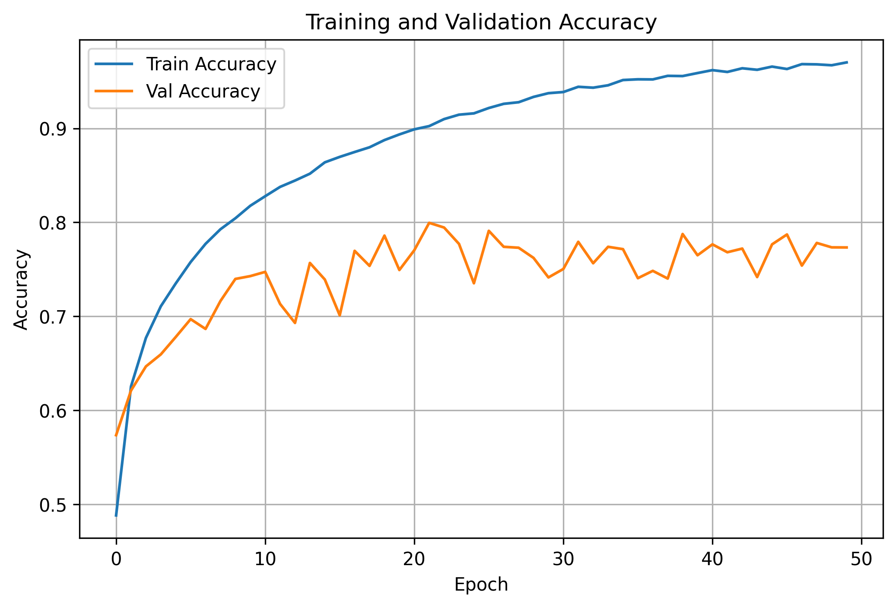
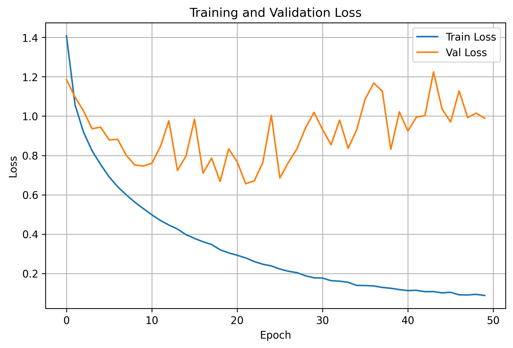
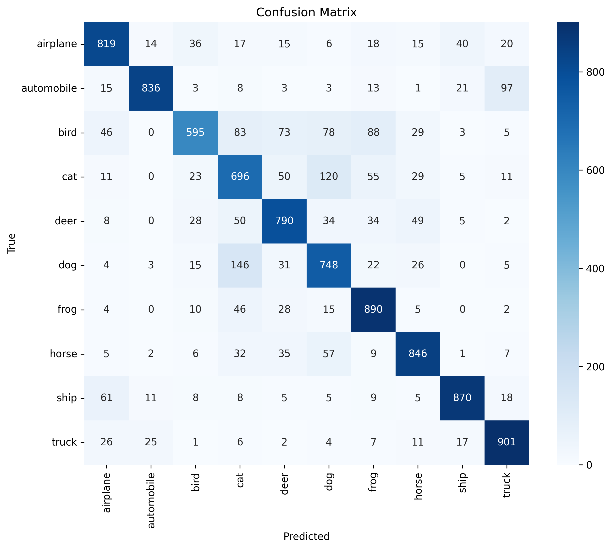

### Dataset:
CIFAR-10

### Architecture:
Custom ResNet15

### Components:
- Residual Blocks
- Batch Normalization
- Global Average Pooling

### Optimizer:
Adam (lr=1e-3)

### Loss:
CrossEntropyLoss

### Best Validation Accuracy:  0.7995

### Test Accuracy: 0.7991

### Training and Validation Accuracy:

### Training and Validation Loss:

### Confusion matrix:

### Classification Report

| Class            | Precision |   Recall | F1-score |   Support |
| :--------------- | --------: | -------: | -------: | --------: |
| airplane         |      0.82 |     0.82 |     0.82 |      1000 |
| automobile       |      0.94 |     0.84 |     0.88 |      1000 |
| bird             |      0.82 |     0.59 |     0.69 |      1000 |
| cat              |      0.64 |     0.70 |     0.67 |      1000 |
| deer             |      0.77 |     0.79 |     0.78 |      1000 |
| dog              |      0.70 |     0.75 |     0.72 |      1000 |
| frog             |      0.78 |     0.89 |     0.83 |      1000 |
| horse            |      0.83 |     0.85 |     0.84 |      1000 |
| ship             |      0.90 |     0.87 |     0.89 |      1000 |
| truck            |      0.84 |     0.90 |     0.87 |      1000 |
| **Accuracy**     |           |          | **0.80** | **10000** |
| **Macro Avg**    |  **0.80** | **0.80** | **0.80** | **10000** |
| **Weighted Avg** |  **0.80** | **0.80** | **0.80** | **10000** |

